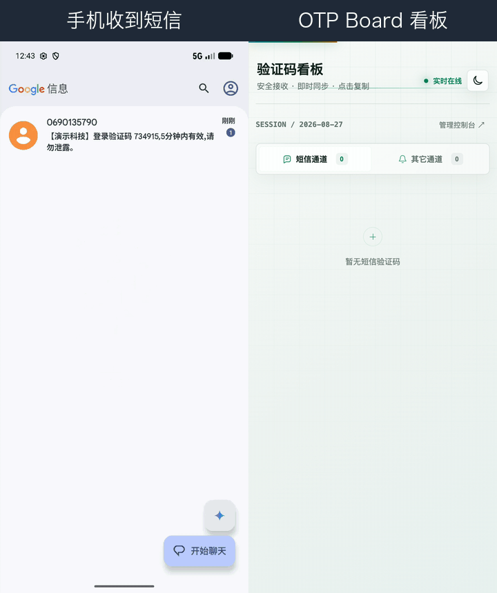

# OTP Board · OTP Forwarder & Dashboard

> English | [中文](./README.md)




An open-source **one-time-passcode (OTP) auto-forwarding + web dashboard** project.
The Android client listens locally for SMS and system notifications (WeChat, WhatsApp,
email, …), extracts the code, and pushes it over HTTPS to your self-hosted Node.js
dashboard for centralized viewing, management, and export.

> All data is sent only to **the server you configure** — no third-party cloud required.

---

## Features

- 📨 **Multi-source ingestion**: SMS/RCS, WhatsApp, WeChat, Telegram, email notifications.
- 🧠 **Smart extraction**: Kotlin and JavaScript share one extraction rule set, port-for-port.
- 🔁 **Durable delivery**: `JobScheduler`-based forwarding with automatic retries.
- 🛡 **De-duplication**: a code is forwarded at most once per 2-minute window (survives restart).
- 🖥 **Two boards**: dashboard splits into "SMS channel" and "Other channel", with delete / clear / CSV export.
- 🔐 **Auth & audit**: admin console password login (optional WebAuthn biometrics); push API token check; per-IP throttling (429) + login audit.
- 🧹 **Auto cleanup**: codes expire after a 24-hour TTL, plus a full daily clear at 23:59; persisted to JSON across restarts.
- ⚙️ **One-click server installer**: self-contained `install.sh` (works with `curl | bash`) — admin console, WebAuthn biometric login, external notifications (Telegram / WeCom / Feishu / Bark / Webhook / Email), rate limiting & audit, out of the box.

---

## Repository layout

```
otp-board/
├── shared/            # Cross-platform / cross-language contract & core (rules, schema, JS core)
├── android/           # Gradle multi-module: :otp-core reusable lib + :app thin UI
├── server/            # Server (WebAuthn / external notifications / admin console)
├── docs/              # requirements.md (hardware list), ARCHITECTURE.md
├── scripts/           # validate-contract.js (CI contract check)
└── .github/workflows/ # CI: core unit tests + contract validation
```

See [`docs/ARCHITECTURE.md`](docs/ARCHITECTURE.md) for the refactor rationale.

---

## Hardware & setup requirements

Bringing this project up involves two environments: a **dev machine** (build the app) and a
**server host** (run the dashboard). The full checklist (CPU / RAM / disk / SDK / physical
device / network & TLS) is in [`docs/requirements.md`](docs/requirements.md).

Quick summary:

| Environment | Key requirement |
| --- | --- |
| Dev machine | JDK 17, Android Studio, SDK Platform 35, ≥16 GB RAM w/ virtualization |
| Physical device | Android 10 (API 29)+, USB debugging + SMS / notification permission |
| Server | Any internet-reachable host, Node.js **≥ 18**, 1 vCPU / 1 GB is enough |
| Network | Server exposed over **HTTPS** (domain + Let's Encrypt, or LAN HTTPS) |

---

## Quick start

This project has two independent parts — the **Server** (dashboard / receiver) and the **Android** client — installed separately and not affecting each other:

- To set up the dashboard / receive forwarded codes → see the **Server** section below.
- To collect codes on a phone and forward them → see the **Android client** section below.

---

### Server

**Option 1: One-click install (recommended)**

otp-board offers two one-click install modes — pick whichever fits:

**① Interactive install (recommended default)** — asks step by step for domain, admin password, refresh interval, push token, HTTP port and auto-start method, then confirms before installing:

```bash
curl -fsSL https://raw.githubusercontent.com/TOBYCAI/otp-board/main/server/install.sh -o install.sh && bash install.sh
```

- This downloads the script to a local `install.sh` first, then runs it in a **real terminal**, so it enters the interactive wizard. If the target dir already has a deployment, the old domain / password / token are reused automatically.
- You can `cat install.sh` to review it before running (the script is in a public repo and fully auditable).

**② Unattended install (servers / CI)** — uses safe defaults (localhost + a random push token) and finishes without prompting:

```bash
curl -fsSL https://raw.githubusercontent.com/TOBYCAI/otp-board/main/server/install.sh | bash
```

- The script is **self-contained**: `server.js`, `shared/js/otp-core.js` and `package.json` are embedded in it — no runtime GitHub fetch, just download this one file. Dependencies (express / @simplewebauthn/server / ws / nodemailer) are installed automatically via `npm install`.
- Pass a directory as the first argument (`bash install.sh /opt/otp-board`; default: `~/otp-board-server`).
- Dashboard: `http://<host>:3001/`, admin console: `http://<host>:3001/admin` (use Nginx/Caddy for TLS in production, see `server/deploy/`).

**Option 2: Download the Release source zip and run it (audit / hack on it)**

1. Go to [Releases](https://github.com/TOBYCAI/otp-board/releases) and download `Source code (zip)`.
2. Extract, then go into the `server/` folder and run it directly:

   ```bash
   cd otp-board/server
   npm install             # deps: express / @simplewebauthn/server / ws / nodemailer
   cp .env.example .env    # adjust domain / admin password / push token / port
   node server.js          # or: pm2 start server.js
   ```

No `curl | bash`, everything is local — easy to audit or modify. The server depends on `express` / `@simplewebauthn/server` / `ws` / `nodemailer`; run `npm install` once before first start.

---

### Android client

No Android Studio, no build: go to [Releases](https://github.com/TOBYCAI/otp-board/releases) and download **`OTP.apk`** (attached automatically to every release), transfer it to your phone and install.

> 🎨 The APK ships a polished Liquid Glass **adaptive icon** (Möbius O design) — looks crisp on the home screen, app drawer and settings.
>
> The APK is built automatically by GitHub Actions on each tag and signed with the **production keystore** (CN=TOBYCAI) — installable right away.

> 🤖 **Android 16 compatibility (v3.2.1+)**: the app now declares `ACCESS_NETWORK_STATE` in its manifest. Android 16 (API 36+) mandates this permission for `JobScheduler` jobs with a network constraint, so on older builds the forward job is rejected on Android 16 devices. Upgrade to v3.2.1 or later to forward normally.

**The Android source is open too**: the full `android/` project (Kotlin + Gradle) ships with the repo, so you can modify it and rebuild yourself. Clone, change the code, then build:

```bash
cd android
./gradlew :app:assembleDebug      # debug: app/build/outputs/apk/debug/app-debug.apk
./gradlew :app:assembleRelease    # release: app-release.apk (renamed OTP.apk on the Release page)
```

(Local build needs JDK 17 + Android SDK 35; if you'd rather not set that up, just use the Release APK above.)

After install:

- Grant SMS-read and notification-listener permissions (for WeChat / WhatsApp / email, etc.).
- **Disable battery optimization (set to "Unrestricted" / allow background):** this is required in practice.
  Without it, the OS kills the app when the screen is locked or after it has been in the background for a while,
  so codes stop arriving and forwarding breaks. Typical path:
  `Settings → Apps → OTP Board → Battery → Unrestricted` (names vary by vendor: Xiaomi "Battery saver = No restrictions",
  Huawei "App launch = Manual + allow background", Samsung "Deep sleeping apps = exclude").
- Scan a QR code carrying the server URL & token ("扫码配置"), or paste the HTTPS URL manually (optional token).
- Incoming codes are extracted and pushed to the dashboard automatically.

---

### Want to build from source?

```bash
# Server
cd server && npm install && cp .env.example .env && node server.js

# Android (needs JDK 17 + Android SDK 35)
cd android
./gradlew :app:assembleDebug      # output: app/build/outputs/apk/debug/app-debug.apk
./gradlew :app:assembleRelease    # output: app/build/outputs/apk/release/app-release.apk
```

---

## Data flow

```
SMS/notification → SmsReceiver / NotificationListener
        → OtpExtractor.process()        [shared rules]
        → OtpDeliveryDeduplicator       [de-dup]
        → OtpForwarder → ForwardJobService (JobScheduler retries)
        → HTTPS POST /otp
        → server.js classify(SMS/Other) → persist → dashboard / API
```

---

## Security & Privacy

OTP Board is designed as a **personal / self-hosted** tool. Here is how it handles your messages and codes:

- **Extraction happens on-device**: code recognition and extraction run entirely on the Android device (`SmsReceiver` and `NotificationListener` both call `OtpExtractor.process()`). The rules are implemented 1:1 in Kotlin (Android) and JavaScript (server mirror).
- **Only the code is forwarded, never the raw text**: the app sends **only the extracted** `{otp, source, platform, time}` over HTTPS POST to your server — the **original SMS / notification body is never transmitted or uploaded**.
- **The server does not do primary extraction**: `shared/js/otp-core.js` is a same-rule mirror of the Android extractor, used only as a **fallback** — it re-extracts only when a legacy client or an email-ingestion path sends raw `content`. The current app's main path extracts on-device, so the server normally never sees the raw body.
- **The server keeps only the extracted result**: the dashboard persists only `{otp, source, time, platform}`, with a 24-hour TTL plus a daily clear at 23:59 (JSON-backed). No original message content is stored.
- **Data goes only to your own server**: all pushes go solely to the HTTPS endpoint you configure in the app — **no third-party cloud, no telemetry**.
- **External notifications are opt-in**: codes are forwarded to Telegram / WeCom / Feishu / Bark / Webhook / Email **only if you configure those channels**. Without them, nothing leaves your device or your server.
- **Endpoint & console hardening**: the push API checks a Token (`OTP_TOKEN` / `x-token`), rate-limits per IP (429), and keeps an audit log; the admin console requires a password and optionally WebAuthn biometrics.

If you have any privacy concerns, open an issue — the entire project (including `install.sh`) is open source and auditable.

---

## License

[MIT](LICENSE) © TOBYCAI
