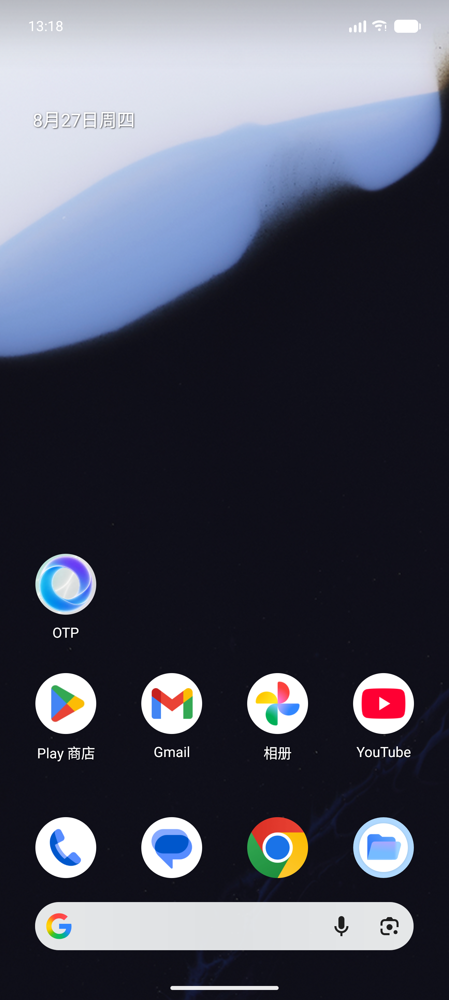
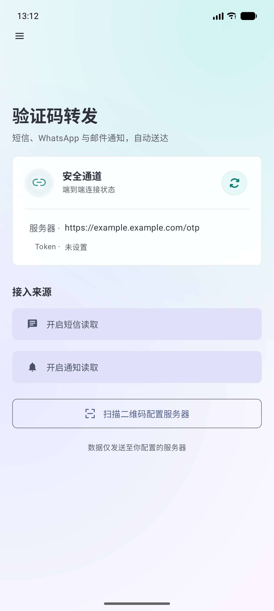

# OTP Board · 验证码转发与看板

> 中文 | [English](./README.en.md)


一款开源的**验证码（OTP）自动转发 + 网页看板**项目。Android 客户端在本地监听短信、
系统通知（微信 / WhatsApp / 邮件等），提取验证码后通过 HTTPS 推送到自建的 Node.js 看板，
在浏览器中集中查看、管理与导出。

> 所有数据仅发送至**你自己配置的服务器**，不依赖任何第三方云服务。

---

## 演示


---

## 特性

- 📨 **多来源接入**：短信（SMS/RCS）、WhatsApp、微信、Telegram、邮件等通知。
- 🧠 **智能提取**：Kotlin 与 JavaScript 双端口共享同一套提取规则，准确率高。
- 🔁 **持久投递**：基于 `JobScheduler` 的可靠转发，网络异常自动重试。
- 🛡 **去重**：同一验证码 2 分钟窗口内只转发一次（跨进程 / 重启仍生效）。
- 🖥 **双看板**：网页看板按「短信通道 / 其它通道」分栏展示，支持删除、清空、CSV 导出。
- 🔐 **鉴权与审计**：管理控制台密码登录（可选 WebAuthn 面容/触控 ID 生物识别）；推送接口 Token 校验；按 IP 限流（429）与登录审计。
- 🧹 **自动清理**：验证码 24 小时 TTL 淘汰 + 每日 23:59 自动清空，重启不丢（JSON 持久化）。
- ⚙️ **一键部署服务端**：单文件自包含安装（`install.sh`，可 `curl | bash` 无人值守）——管理控制台、WebAuthn 面容/触控 ID 登录、外部通知（Telegram/企业微信/飞书/Bark/Webhook/邮件）、限流与审计，开箱即用。

---

## 仓库结构

```
otp-board/
├── shared/            # 跨端 / 跨语言共用契约与核心（提取规则、负载 schema、JS 核心）
├── android/           # Gradle 多模块：:otp-core 复用库 + :app 薄壳 UI
├── server/            # 服务端（WebAuthn/外部通知/管理控制台）+ 部署示例
├── docs/              # requirements.md（硬件设备清单）、ARCHITECTURE.md（架构说明）
├── scripts/           # validate-contract.js（CI 校验契约一致性）
└── .github/workflows/ # CI：核心单元测试 + 契约校验
```

详细的代码梳理与“通用化”说明见 [`docs/ARCHITECTURE.md`](docs/ARCHITECTURE.md)。

---

## 前期硬件设备与配置要求

搭建与运行本项目涉及**开发机（编译 App）**与**服务端主机（运行看板）**两类环境。
完整清单（CPU / 内存 / 磁盘 / SDK / 真机要求 / 网络与 TLS）见
[`docs/requirements.md`](docs/requirements.md)。

要点速览：

| 环境 | 关键要求 |
| --- | --- |
| 开发机 | JDK 17、Android Studio、SDK Platform 35、开启虚拟化的 ≥16 GB 内存 |
| 真机 | Android 10（API 29）及以上，开启 USB 调试 + 短信 / 通知权限 |
| 服务端 | 任意可联网主机、Node.js **≥ 18**、1 vCPU / 1 GB 即可 |
| 网络 | 服务端暴露 **HTTPS**（域名 + Let's Encrypt，或局域网内 HTTPS） |

---

## 快速开始

本项目分两部分，**服务端（Server）** 与 **安卓客户端（Android）** 各自独立安装、互不影响：

- 想搭建看板 / 转发接收端 → 看下面 **服务端** 部分。
- 想在手机上收验证码并转发 → 看下面 **安卓客户端** 部分。

---

### 服务端（Server）

**方式一：一键安装（推荐）**

otp-board 提供两种一键安装方式，按需选择：

**① 交互式安装（默认推荐）** —— 会逐项询问域名、管理控制台密码、刷新间隔、推送 Token、HTTP 端口与开机自启方式，最后确认后再安装：

```bash
curl -fsSL https://raw.githubusercontent.com/TOBYCAI/otp-board/main/server/install.sh -o install.sh && bash install.sh
```

- 这条命令先把脚本下载到本地 `install.sh`，再用**真实终端**运行它，因此会进入交互式向导；若目标目录已有旧部署，会自动沿用原域名 / 密码 / Token。
- 建议先 `cat install.sh` 看一眼内容再运行（脚本在公开仓库中完全可见、可审计）。

**② 无人值守安装（服务器 / CI）** —— 使用默认值（localhost + 随机推送 Token）直接装完，不询问：

```bash
curl -fsSL https://raw.githubusercontent.com/TOBYCAI/otp-board/main/server/install.sh | bash
```

- 脚本**自包含**：`server.js`、`shared/js/otp-core.js`、`package.json` 全部内嵌其中，运行时不依赖 GitHub，下载这一个文件即可；依赖（express / @simplewebauthn/server / ws / nodemailer）由脚本自动 `npm install` 安装。
- 可选第一个参数指定目录：`bash install.sh /opt/otp-board`（默认装到 `~/otp-board-server`）。
- 看板启动后访问 `http://<host>:3001/`，管理控制台 `http://<host>:3001/admin`（生产建议用 Nginx/Caddy 做 HTTPS 反代，见 `server/deploy/`）。

**方式二：下载 Release 源码包自己跑（适合审计 / 改代码）**

1. 打开 [Releases](https://github.com/TOBYCAI/otp-board/releases) 页面，下载 `Source code (zip)`。
2. 解压后进入其中的 `server/` 目录，直接运行：

   ```bash
   cd otp-board/server
   npm install             # 安装依赖（express / @simplewebauthn/server / ws / nodemailer）
   cp .env.example .env    # 按需修改域名 / 管理密码 / 推送 Token / 端口
   node server.js          # 或：pm2 start server.js
   ```

这种方式不需要 `curl | bash`，所有文件都在本地，方便审计与二次开发。服务端依赖 `express` / `@simplewebauthn/server` / `ws` / `nodemailer`，首次运行前执行 `npm install` 即可。

---

### 安卓客户端（Android）

不用装 Android Studio、不用编译——去 [Releases](https://github.com/TOBYCAI/otp-board/releases) 页面下载 **`OTP.apk`**（每个版本都会自动构建并附在 Release 里），传到手机安装即可。

> 🎨 APK 采用 Liquid Glass 风格**自适应图标**（Möbius O 设计），桌面 / 应用抽屉 / 设置页均精致显示。
>
> APK 由 GitHub Actions 在打 tag 时自动构建并用**生产 keystore 签名**（CN=TOBYCAI），可直接安装使用。

> 🤖 **Android 16 兼容（v3.2.1+）**：已在 `AndroidManifest.xml` 声明 `ACCESS_NETWORK_STATE`。Android 16（API 36+）对带网络约束的 `JobScheduler` 任务强制要求该权限，旧版本安装在 Android 16 设备上时转发 Job 会被系统拒绝；升级到 v3.2.1 及以上即可正常转发。

| 应用图标 | 应用主页 |
| :---: | :---: |
|  |  |

**安卓源码也随仓库一并开源**：完整 `android/` 工程（Kotlin + Gradle）就在仓库里，可以自行修改、重新构建。克隆仓库后改代码再编译：

```bash
cd android
./gradlew :app:assembleDebug      # 调试版：app/build/outputs/apk/debug/app-debug.apk
./gradlew :app:assembleRelease    # 发布版：app-release.apk（CI 上传 Release 时命名为 OTP.apk）
```

（本地编译需要 JDK 17 + Android SDK 35；不想装环境的话直接用上面的 Release APK 即可。）

安装后：

- 授权短信读取、通知读取（监听微信 / WhatsApp / 邮件等通知）。
- **关闭电池优化（设为「不受限制 / 允许后台）**：这是实测必须的一步——不关的话，锁屏或后台一段时间后会
  被系统杀掉，导致验证码收不到、转发中断。路径一般在
  `设置 → 应用 → OTP Board → 电池 → 不受限制`（各厂商叫法不同，如小米「省电策略=无限制」、
  华为「启动管理=手动管理并允许后台」、三星「深度休眠=排除」）。
- 「扫码配置」扫描包含服务器地址与 Token 的二维码（可自行生成），或手动填 HTTPS 地址（可选 token）。
- 收到验证码，App 自动提取并推送到看板。

---

### 只想自己从源码构建？

```bash
# 服务端
cd server && npm install && cp .env.example .env && node server.js

# 安卓（需 JDK 17 + Android SDK 35）
cd android
./gradlew :app:assembleDebug      # 产物：app/build/outputs/apk/debug/app-debug.apk
./gradlew :app:assembleRelease    # 产物：app/build/outputs/apk/release/app-release.apk
```

---

## 数据流

```
短信/通知 → SmsReceiver / NotificationListener
        → OtpExtractor.process()        [shared 提取规则]
        → OtpDeliveryDeduplicator       [去重]
        → OtpForwarder → ForwardJobService（JobScheduler 持久重试）
        → HTTPS POST /otp
        → server.js 分类(短信/其它) → 持久化 → 看板 / API
```

---

## 安全与隐私

OTP Board 设计为**纯自用 / self-hosted** 工具。以下说明它如何处理你的短信与验证码：

- **提取在本地完成**：验证码的识别与提取完全在 Android 设备上进行（`SmsReceiver` 与 `NotificationListener` 均调用 `OtpExtractor.process()`）。提取规则以 Kotlin（安卓端）与 JavaScript（服务端镜像）双端实现，二者 1:1 对齐。
- **只转发验证码，不转发原文**：App 仅把**提取出的** `{验证码, 来源通道, 平台, 时间}` 通过 HTTPS POST 到你的服务器，**原始短信 / 通知正文不会被发送或上传**。
- **服务端不做主提取**：`shared/js/otp-core.js` 是安卓端提取逻辑的同规则镜像，仅作**兜底**——当旧版客户端或邮件摄入等路径发来原始 `content` 时，服务端才会用它重新提取；当前 App 的主链路走端上提取，服务端默认不会拿到原始正文。
- **服务端只留存提取结果**：看板仅持久化 `{验证码, 来源通道, 时间, 平台}`，24 小时 TTL 自动淘汰 + 每日 23:59 清空（JSON 持久化），不保存任何原始短信内容。
- **数据只到你自己的服务器**：所有推送仅发往你在 App 中配置的 HTTPS 地址，**不依赖任何第三方云服务、不含遥测 / 埋点**。
- **外部通知需你主动配置**：仅当你自行填写 Telegram / 企业微信 / 飞书 / Bark / Webhook / 邮件 等渠道时，验证码才会按你的配置外发；不填则完全不出本机与你的服务器。
- **接口与控制台防护**：推送接口做 Token 校验（`OTP_TOKEN` / `x-token`）、按 IP 限流（429）与登录审计；管理控制台需密码登录，支持可选 WebAuthn 面容 / 触控 ID 生物识别。

若你对隐私有任何疑问，欢迎在仓库 issues 中讨论——整个项目（含 `install.sh`）开源可审计。

---

## 许可证

[MIT](LICENSE) © TOBYCAI
